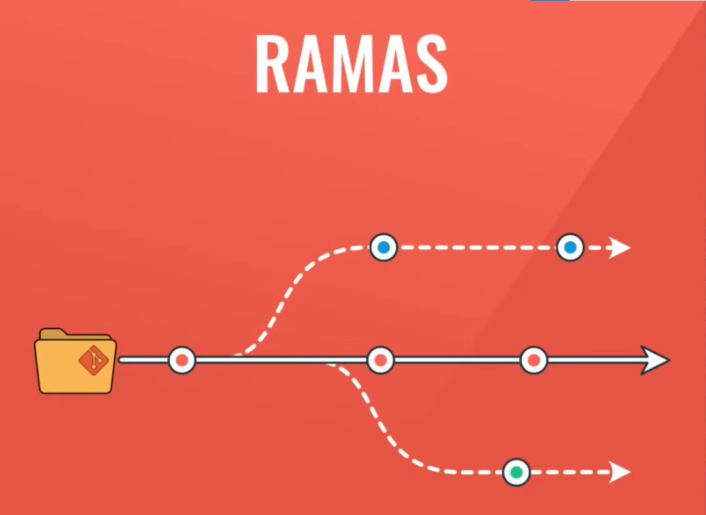
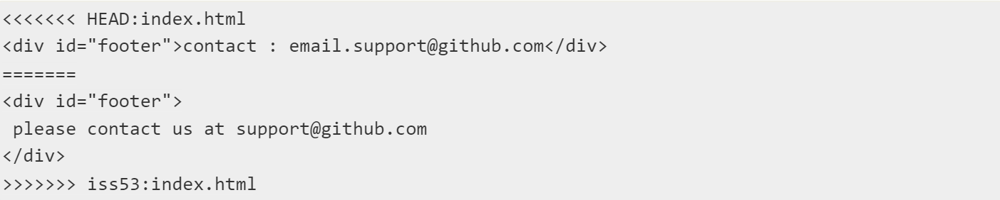

# **CURSO GIT**
# CLASE 1
## Repositorio
Es todo proyecto que tiene un seguimiento por Git.
## COMANDO: git init
Comando para inicializar Git en un directorio.
## COMANDO: git add
Indica a Git que quieres incluir actualizaciones en un archivo/directorio concreto en la próxima confirmación.
## COMANDO: git commit
Comando para el generar un registro de un cambio. ***[Tipo commmit: descripción de 40 caracteres máximo]***
1. git commit `<file>`
2. git commit -m `<descripción>`
3. git commit file -m `<descripción>`
## COMANDO: git log
Comando para ver el historial de cambios.
1. Muestra los SHA en una sola línea: **git log --oneline**
2. Muestra todas las ramas: **git log --graph**
## README
Es la carta de presentación de un proyecto, está elaborado en Markdown. 
[**Tutorial Markdown**](https://tutorialmarkdown.com/sintaxis)

# CLASE 2
## COMANDO: git branch 
Devuelve todas las ramas existentes.
## COMANDO: git branch nomRama
Crea la rama a partir de la rama padre (en la que nos encontramos), los cambios que ocurren en una rama no afectan a otras hasta utilizar un merge.
## COMANDO: git checkout nomRama
Nos permite navegar entre las ramas.
## COMANDO: git merge nomRama
Obtiene los cambios de la rama indicada en el comando y los actualiza en la rama en la que nos encontramos.
## COMANDO: git config
1. --global user.name `<nombreUsuario>`
2. --global user.email `<email>`
## File explorer y las ramas
Los archivos y sus cambios se van a mostrar de acuerdo a la rama en la que nos encontremos.
## Conflictos
Dos ramas modifican el mismo archivo, entonces Git no sabes que version del archivo implementar.

# CLASE 3
## Ramas
1. Main/Master.- Es la rama principal.
2. Otras ramas.- Son bifurcaciones de la rama principal, son copias del proyecto pero separada para poder ser trabajadas.

## Fast forward
Una rama A se fusiona a la rama B incluyendo los commits **(git merge `<rama>`)**.
## No fast forward
Una rama A se fusiona a la rama B integrados los cambios de A en B, pero con la diferencia de que la visualización de la rama A queda separada de la rama B **(git merge `<rama>` --no-ff)**
*Tanto si usamos Fast forward como No fast forward solo cambiara la forma en la que visualizaremos el histórico de nuestro repositorio*
## COMANDO: git merge -s ours `<rama>`
Los cambios de la rama A se conservan mientras no hayan conflictos con la rama B, en caso de conflicto se prioriza lo que está en la rama B (la rama en la que nos encontramos, *nuestra rama*).
## COMANDO: git merge -s theirs `<rama>`
Los cambios de la rama A se conservan mientras no hayan conflictos con la rama B, en caso de conflicto se prioriza lo que está en la rama A (la rama que queremos traer, *rama de ellos*).

## COMANDO: git pull-request
Petición para hacer cambios en la rama main.

# CLASE 4 y 5
## GitHub
Es un repositorio en la nube, existen otros como GitLab o Bitbucket.
## COMANDO: git remote -v
Nos permite ver el repositorio remoto al que estamos conectados.
## COMANDO: git remote add origin `<link>`
Obtenemos acceso al repositorio en la nube.  
Origin es el fuente/origen del repositorio en el que trabajaremo en GitHub.
## COMANDO: git push 
Subimos una rama al repositorio origin.
   - **git push -u origin `<rama>`**
## COMANDO: git clone `<link>`
Comando para clonar la rama principal de un repositorio pero con **git checkout `<rama>`** podemos ingresar a las otras ramas existentes del repositorio.
## COMANDO: git pull
Comando para agregar una rama a nuestro repositorio local, luego debemos escribir ***git checkout `<rama>`*** para ingresar a la rama y así poder visibilizarla con el **git branch**.
1. **git pull origin `<rama>`**

# CLASE 5
## Flujo de Trabajo en equipos
Conjunto de reglas a las cuales se rige un repositorio.
## 1. Basic Workflow
Usualmente se usa individualmente en un proyecto pequeño.

## 2. Feature Branch Workflow
Suele ser usado en trabajos en equipo para proyectos pequeños.

## 3. Gitflow Workflow
Se utilizan en trabajos en equipo para proyectos más grandes y extensos.

1. Main.- Es la versión del proyecto, en esta rama se añaden los proyectos ya finalizados y que hayan pasado por el release o hotfix en algunos casos.
2. Hotfix.- Es un parcheo o arreglo inmediato del proyecto. De aquí nacen las versiones 1.2, 2.1.2, etc
3. Release.- Últimos detalles como revisiones, documentación concisa y testeo.
4. Develop.- Desarrollo y documentación de código.
5. Feature.- Ramas de desarrollo pertenecientes a cada integrante del equipo. 
**De la rama Main al Develop son únicas**
## 4. Forking Workflow
Consiste en clonar el repositorio y emplear algunos de los anteriores Workflow

# CLASE WINSOR
## COMANDO: git fetch
Nos permite descargar contenido (metadatos) desde un repositorio remoto, sirve para comprobar si hay algún cambio disponible, pero no hace modificaciones en los archivos a diferencia de git pull. 

## COMANDO: git rebase
Reorganiza, es decir puedes capturar todos los cambios confirmados en una rama y reaplicarlos sobre otra. No hay ninguna diferencia en el resultado final de la integración, pero el haberla hecho reorganizando nos deja un historial más claro. Si examinas el historial de una rama reorganizada, este aparece siempre como un historial lineal: como si todo el trabajo se hubiera realizado en series, aunque realmente se haya hecho en paralelo. 
**Peligro de reorganizar.-** Nunca reorganices confirmaciones de cambio (commits) que hayas enviado (push) a un repositorio público. 
**Reorganizar vs. Fusionar.-** La manera de sacar lo mejor de ambas es reorganizar tu trabajo local, que aún no has compartido, antes de enviarlo a algún lugar; pero nunca reorganizar nada que ya haya sido compartido.

## Etiquetas (Tags)
Sirven como un puntero, el cual se asocia a un commit especifico. Se usa típicamente para marcar versiones de lanzamiento.
## COMANDO: git tag
- Para enlistar todos los tags: **git tag**
- Crear etiqueta anotada: **git tag -a `<nombre>` -m `<mensaje>`**
- Crear etiqueta ligera: **git tag `<nombre>`**
- Para ver la información de un commit asociado a una etiqueta: **git show `<etiqueta>`**
- Para asociar etiquetas a un commit anterior: **git tag -a `<etiqueta>` `<SHA>`**

## Merge
Sirve para fusionar dos ramas, Git tiene varias estrategias de fusión y evalua automaticamente cual es más conveniente. Sin embargo pueden existir conflicto si hay modificaciones dispares en una misma porción de un mismo archivo en las dos ramas distintas que pretendes fusionar, Git no será capaz de fusionarlas directamente por lo que será necesario resolver el conflicto de manera manual (haciendo uso de mergetool).

Donde nos dice que la versión en HEAD (la rama master, la que habías activado antes de lanzar el comando de fusión) contiene lo indicado en la parte superior del bloque (todo lo que está encima de =======) y que la versión en iss53 contiene el resto, lo indicado en la parte inferior del bloque. 
Una vez solucionado el conflicto debes realizar un commit y detallar como lo resolviste a no ser que resulte obvio.

## Fork
Sirve para crear una copia de un repositorio remoto en nuestra cuenta de GitHub, de esta manera tener total libertad para realizar modificaciones sin alterar el repositorio remoto original.

## Pull request
Posterior a los cambios en un repositorio fork, se realiza pull request como una petición de cambios en el repositorio remoto original.

## Alias
Sirve para relacionar un comando extenso a un comando elaborado por uno mismo.
- Ejemplo 1: **git config --global alias.co checkout**
- Ejemplo 2: **git config --global alias.last 'log -1 HEAD'**
- Enlistar alias: **git config --list | grep alias**
- Borrar alias: **git config --global --unset alias.`<nombreAlias>`**

## Visualizar commits
- Para observar commits individualmente: **git show**
- Para observar los commits de la ramaB que no están en la ramaA: **git log `<ramaA>`..`<ramaB>`**
- Para observar los commits de varias ramas que no posean commits de otras ramas: **git log `<rama1>` `<rama2>` `<ramaX>` --not `<ramaA>` `<ramaB>` `<ramaC>`**

## Stash
Son guardados rápidos y temporales que se hacen en Git, se usan para poder cambiar de rama sin realizar commits ni perjudicar la rama actual.
- Guardar la rama temporalmente: **git stash**
- Ver la lista de stash: **git stash list**
- Recuperar un stash específico: **git stash apply stash@{`<N>`}**
- Recuperar el último stash y lo elimina del stash: **git stash pop**
- Eliminar un stash especifico: **git stash drop stash@{`<N>`}**
- Eliminar todos los stash: **git stash clear**

## Busquedas Grep
Son realmente rápidas, busca a través de cualquier árbol en Git, no solo en el directorio de trabajo.
- Encontrar coincidencias por archivo: **git grep -n `<pattern>`**
- Enumerar coincidencias por archivo: **git grep -c `<pattern>`**

## Fusión avanzada
- Abortar una fusión: **git merge --abort**
- Ignora los cambios en cualquier cantidad de espacios en blanco existentes: **git merge -Xignore-all-space**
- Ignora por completo todos los cambios de espacios en blanco: **git merge -Xignore-space-change**
- **git merge -X ours**
- **git merge -X theirs**

## RESET
Ofrece el control de hacia donde apunta el HEAD, siendo N los pasos a retroceder el puntero hasta obtener un puntero anterior (no necesariamente retrocede linealmente) MÉTODO DESTRUCTIVO.
- Mantiene los cambios que ocurrieron antes de hacer commit desde donde apuntaba: **git reset --soft HEAD~`<N>`**
- Descarta los cambios: **git reset --hard HEAD~`<N>`**
- Otra manera es indicando el SHA: **git reset HEAD `<SHA>`**

## REVERT
Revierte los cambios que un commit introdujo, y crea un nuevo commit con los cambios revertidos, MÉTODO NO DESTRUCTIVO.
- **git revert `<SHA>`** o **git revert HEAD~`<N>`**

## DIFF
Compara dos rama y establece las diferencias en los orígenes de datos de Git
- Por defecto se compara con su misma rama en remoto: **git diff**
- Comparar con otra rama: **git diff `<ramaB>`**

# OTRAS FUENTES
## Flujo de trabajo en GIT
1. Computador.- Trabajo realizado en los distintos archivos de un proyecto.
2. Stage.- Con git add seleccionamos los archivos que pasamos a la etapa stage para poder verificar los cambios de un archivo.
3. Commit.- Con git commit comprometemos cambios de un archivo para poder pasarlos al repositorio.
4. Server.- Con git push pasamos los cambios seleccionados a un servidor

## Ignorar archivos y directorios
Creamos el archivo .gitignore e indicamos los archivos y directorios que no queramos añadir al stage.

## ¿Por qué origin?
Es el nombre predeterminado que recibe el repositorio remoto principal, sin embargo cuando se trabaja con mas de un repositorio remoto estos puede ser asociados a otros nombres.

## Otros comandos
1. Quitar un elemento que fue añadido al stage: **git restore --staged `<file>`**
2. Recuperar un archivo eliminado: **git restore `<file>`**
3. Nos permite ver todos los repositorios remotos: **git remote**
4. Deshacer los cambios que hemos hecho: **git revert `<idRama>`**
5. Para ver los cambios del archivo: **git show `<archivo>`**
6. Para ver la documentación y utilidades de un comando: **git `<comando>` --help**

## Links interesantes de Platzi
1. [Flujo de trabajo profesional y comandos oscuros](https://platzi.com/blog/flujo-de-trabajo-y-comandos-oscuros-de-git/) 
2. [Todos los comandos del curso](https://platzi.com/tutoriales/1557-git-github/4037-todos-los-comandos-del-curso-v20/)
3. [Resumen de comandos](https://platzi.com/tutoriales/1557-git-github/333-resumen-de-comandos/ )